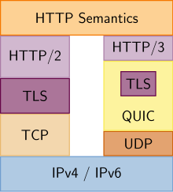
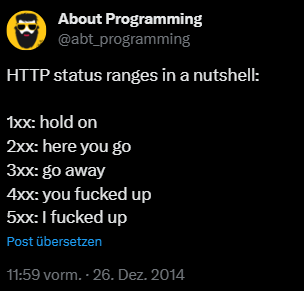

---
title: "Vorlesung Webengineering I - HTTP & REST"
topic: "Webengineering_1_1"
date: 2024-01-15
author: "Lukas Panni"
theme: "Berlin"
colortheme: "dove"
fonttheme: "structurebold"
fontsize: 12pt
urlcolor: olive
linkstyle: boldslanted
aspectratio: 169
lang: de-DE
section-titles: true
toc: true
numbersections: true
plantuml-format: svg
...

# HTTP

## Hypertext Transfer Protocol (HTTP) - Grundlage des Web

- Übertragung von Daten zwischen Webbrowser und Webserver
- Textbasiertes Protokoll
- **Zustandsloses** Protokoll, Request-Response Prinzip
  - Protokoll speichert keine Informationen!
  - Jedes Request-Response-Paar ist unabhängig voneinander
  - Erhöht Skalierbarkeit \rightarrow{} dazu später mehr
  - ABER: Zustandsinformationen (z.B. Logindaten) müssen auf andere Art und Weise gespeichert werden

## Kurze Historie: HTTP-Versionen

- 1996: **HTTP/1.0**
- 1999: **HTTP/1.1**
  - Verschiedene Verbesserungen, z.B. Pipelining zur Reduktion von TCP-Verbindungen
  - Einführung von optionalem "Host"-[[HTTP-Header|Header]]
    - → ermöglicht Nutzung von einem physischen Server für mehrere Webseiten
- 2015: **HTTP/2**
  - **Ziel**: Performanceverbesserungen und Optimierungen
  - Volle Abwärtskompatibilität
  - Multiplexing: mehrere Anfragen über eine Verbindung
  - Server-initiierte Datenübertragung \rightarrow{} konnte sich nicht durchsetzen, seit Chrome 106 (September 2022) nicht mehr unterstützt

## HTTP-Versionen

- 2022: **HTTP/3**
  - Neues Übertragungsprotokoll: **QUIC**
  - Bei zuvor genutztem Multiplexing über TCP ist Head-of-Line-Blocking möglicht
    - Bei Paketverlust müssen alle folgenden Pakete (aller gemultiplexten Streams) auf erneute Übertragung des Verlorenen warten
  - Mehrere nutzt _unabhängige_ parallele Datenströme über UDP, Head-of-Line-Blocking betrifft jeweils nur einen Stream

## HTTP-Versionen - HTTP/3 vs. HTTP/2

{height=65%}

_https://de.wikipedia.org/wiki/Hypertext_Transfer_Protocol#/media/Datei:HTTP-2_vs._HTTP-3_Protocol_Stack.svg_

## HTTP Request - Response

**Request**:

```
GET / HTTP/1.1
Host: lukaspanni.de
Accept: */*

```

Response:

```
HTTP/1.1 200 OK
Content-Type: text/html
Date: Fri, 17 Nov 2023 12:26:59 GMT

<!DOCTYPE html>
...

```

## HTTP-Request - Aufbau

- Request besteht aus einzelnen Textzeilen (Header), jeweils mit `<CR><LF>` (Zeilenumbruch) getrennt

  - Headeesendet nach Leerzeile (= `<CR><LF><CR><LF>`)

- Erste Zeile "Request-Line": `<Methode> <Resource> <Protokoll><CR><LF>`
  - Methode: `GET`
  - Resource: `/` (Hauptseite)
  - Protokoll: `HTTP/1.1` (aktuellste Version 3, heute meist Version 2 eingesetzt)

## Verbreitung der HTTP-Versionen

{height=80%}

_https://blog.cloudflare.com/content/images/2023/06/download-3.png_

## HTTP Header

- Jede weitere Zeile im Request: `<Key>: <Value><CR><LF>`

- `Host: lukaspanni.de` \rightarrow{} Pflicht-Header ab HTTP/1.1
  - Erlaubt virtuelle Hosts: mehrere Webseiten auf einem physischen Server (und einer IP)
- `Accept: */*` \rightarrow{} Format der Antwort egal

- Viele weitere Standard Request-Header:
  - User-Agent
  - Accept-Encoding
  - Accept-Language
  - Cookie
  - ...
- Steuern verschiedene Funktionen, dazu später mehr

## Adressierung im Web: Uniform Resource Locator (URL)

- Grundsätzlicher Aufbau: `<schema>:<schema-spezifisch>`
- HTTP: `http://<host>:<port>/<pfad>?<query>#<fragment>`
  - `<host>`: der Domainname / die IP des angefragten Servers \rightarrow{} Host-Header
  - `<port>`: TCP-Port des Webservers, HTTP 80 (HTTPS 443)
  - `<pfad>`: Pfad zur Ressource (konkrete "Seite") \rightarrow{} erste Zeile des Requests
  - `<query>`: Zusatzinformationen, z.B. Filter oder Anzeigeformate
  - `<fragment>`: Verweis auf bestimmten Abschnitt einer Webseite z.B. [wikipedia.org/wiki/URL#Fragment](https://de.wikipedia.org/wiki/URL#Fragment)

## HTTP Anfragemethoden

Verschiedene Methoden zum Ausdruck der _Semantik_

### Wichtige Methoden

| **Methode** | **Beschreibung**                  |
| ----------- | --------------------------------- |
| **GET**     | Ressource abrufen                 |
| **HEAD**    | Header für Ressource abrufen      |
| **POST**    | Ressource erstellen               |
| **PUT**     | Ressource ersetzen                |
| **DELETE**  | Resource löschen                  |
| **OPTIONS** | Liste erlaubter Methoden anfragen |


## HTTP Request-Body

- z.B. für _POST_ und _PUT_ weitere Informationen benötigt
- Übertragung im optionalen **Body** 
- Beginnt nach einer Leerzeile
- Darf beliebigen _Text_ enthalten 

## HTTP Request - Response

Request:

```
GET / HTTP/1.1
Host: lukaspanni.de
Accept: */*

```

**Response**:

```
HTTP/1.1 200 OK
Content-Type: text/html
Date: Fri, 17 Nov 2023 12:26:59 GMT

<!DOCTYPE html>
...

```

## HTTP-Response (Aufbau)

- Wie Request einzelne Textzeilen, jeweils mit `<CR><LF>` getrennt
- Erste Zeile "Status-Line": `<Version> <Status-Code><Status-Message>`
  - Version: `HTTP/1.1` 
  - Status-Code: 200
  - Status-Message: OK
- Danach folgt der Response-Body, Aufbau wie Request-Body


## HTTP Status Codes (Antwort)

Aufgeteilt in 5 Gruppen:

| **Bereich** | **Kategorie** | **Zweck**                                                                       |
| ----------- | ------------- | ------------------------------------------------------------------------------- |
| 1xx         | Informational | Informationen über den aktuellen Stand, kaum relevant                           |
| 2xx         | Success       | Request war erfolgreich                                                         |
| 3xx         | Redirection   | Client muss andere Seite aufrufen, Server teilt dem Client mit welche / Auswahl |
| 4xx         | Client Error  | Fehler, der Client ist schuld                                                   |
| 5xx         | Server Error  | Fehler, der Server ist schuld                                                   |

## HTTP Status Codes

{height=70%}

## Wichtige HTTP Status Codes

- Erfolgreicher Request: 200 OK, enthält gewünschte Ressource
- Weiterleitung: 301 Moved Permanently, z.B. alte URL benutzt, HTTPS-Redirect
- Nicht erlaubt (Rechte nicht ausreichend): 403 Forbidden
- Nicht vorhanden: 404 Not Found

## HTTP Content Negotiation

- Feature das eine _automatische_ Einigung auf ein Ausgabeformt ermöglicht
- Ermöglicht verschiedene _Repräsentationen_ für die gleiche _Ressource_
- Weitere Header für Sprache (`Accept-Language`) und Kodierung `Accept-Encoding`
- Format der Antwort über `ContentType`, `Language`, `Encoding` Header angegeben

- Server-driven (Server entscheidet):
  - Client sendet gewünschtes Format im `Accept`-Header
  - Angabe mehrerer Formate: z.B. `Accept: text/html,text/plain`
  - Server gibt die Antwort im ersten untertützten Format zurück

## HTTP Content Negotiation

```{.plantuml height=50%}
Client->Server : GET /; Accept: application/json, text/xml
Server->Client : 200 OK, ContentType: application/json
```

## HTTP Content Negotiation

- Agent-driven (Client entscheidet)
  - Gleicher Beginn, Server antwortet mit Liste verfügbarer Repräsentationen
  - Client kann die am besten passende auswählen und anfragen

```{.plantuml height=50%}
Client->Server : GET /; Accept: application/json, text/xml
Server->Client : 300 Multiple Choices; ...
Client->Server : GET /r1; Accept: application/json
Server->Client : 200 OK, ContentType: application/json
```

## HTTP Content Negotiation

- Beide Varianten haben Vor- und Nachteile

|               | **Nachteile**             | **Vorteile**                                                                              |
| ------------- | ------------------------- | ----------------------------------------------------------------------------------------- |
| Server-driven | gute Unterstzützung       | Server kann nicht optimal entscheiden                                                     |
| Agent-driven  | kein einheitliches Format | - Client kann die optimale Entscheidung treffen \newline - zusätzlicher Request notwendig |


# REST

## REST?


