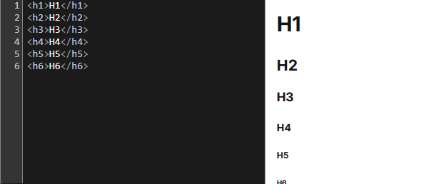
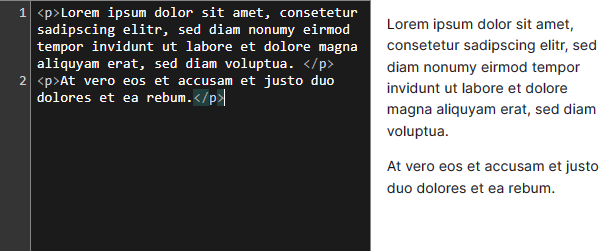
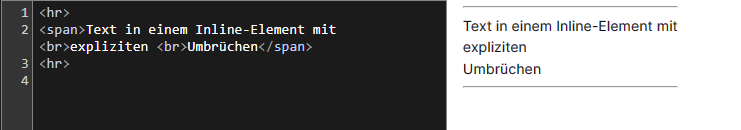
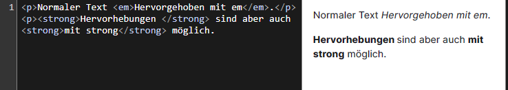
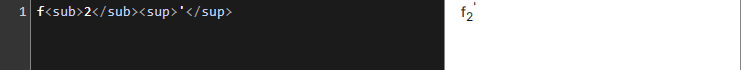
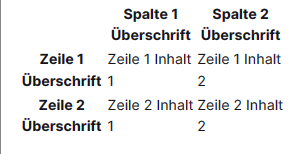
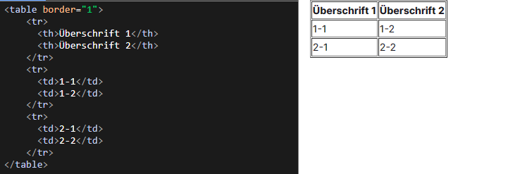
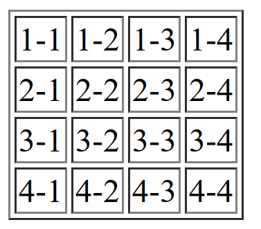
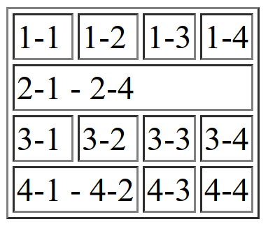
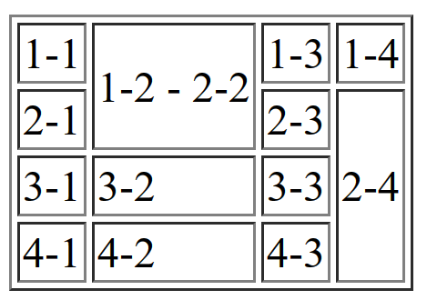

---
title: "Vorlesung Webengineering I - HTML"
topic: "Webengineering_1_2"
date: 2024-01-15
author: "Lukas Panni"
theme: "Berlin"
colortheme: "dove"
fonttheme: "structurebold"
fontsize: 12pt
urlcolor: olive
linkstyle: boldslanted
aspectratio: 169
lang: de-DE
section-titles: true
toc: true
numbersections: true
plantuml-format: svg
...

# HTML - Grundlagen

## Grundlagen

**H**yper**t**ext **M**arkup **L**anguage

- Auszeichnungssprache: Beschreibt **Struktur** und **Inhalt**
- Erste Version: Tim Berners-Lee - CERN 1990er
  - Tim Berners-Lee = "Erfinder" des Web: HTTP, HTML, URL, Webbrowser
  - Weiterentwicklung durch World Wide Web Consortium (W3C)

## Grundstruktur

```html
<!doctype html>
<html>
  <head>
    <title>Titel</title>
    <meta charset="utf-8" />
  </head>
  <body>
    <!-- Kommentar -->
    <p>Inhalt (Absatz)</p>
  </body>
</html>
```

## Grundstruktur

- Dateiendung: `.html`, `.htm`
- `<!DOCTYPE html>`: Angabe des Dokumententyps, Browser verstehen das Dokument auch ohne
- 2 Komponenten
  - **Head**: Metadaten, z.B. Titel, Encoding, Scripte
  - **Body**: eigentlicher Inhalt

## Syntax

- HTML-Elemente ("Tags") bestehen i.d.R. aus Start- und End-Tag
  - Öffnender Tag `<ELEMENT>`
  - Inhalt
  - Schließender Tag `</ELEMENT>`
  - Ausnahmen für z.B. Zeilenumbruch `<br>`, müssen nicht geschlossen werden
- HTML-Dokument ist eine Sammlung solcher Tags (mit einigen Regeln für die Verschachtelung)
- Inhalt der Seite innerhalb des `<body>`-Tags

## Syntax - Attribute

- Tags können mit **Attributen** angereichert werden
- Key-Value Paare
- Angabe im öffnenden Tag
- `<ELEMENT ATTRIBUT="VALUE"> ... </ELEMENT>`
- Nutzbarkeit abhängig vom Tag


## Head

- Umschlossen mit `<head>`-Tag
- Möglicher Inhalt
  - `<title>` Titel der Seite, darf nur einmal vorkommen
  - `<meta>` beliebige Metadaten (als Attribute)
  - `<link>` Links zu verwandten Ressourcen, z.B. Stylesheets
  - `<style>` direkte Angabe von **CSS**-Styles
  - `<script>` **JavaScript**-Code oder Link auf einzubindendes Script
- In der Regel wird zumindest ein Titel und der Zeichensatz (Charset = Codierung) angegeben
  ```html
  <meta charset="utf-8" /> <title>Titel</title>
  ```

## Body

- Umschlossen mit `<body>`-Tag
- Alle Elemente im Body können vom Browser dargestellt werden
- Schachtelung:
  - `<tag1><tag2>Inhalt</tag2></tag1>`
  - \rightarrow{} Tags müssen in der richtigen Reihenfolge geschlossen werden
  - `<tag1><tag2>Inhalt</tag1></tag2>` \rightarrow{} geht nicht!
  - Inline Elemente können keine Block Elemente enthalten

# HTML Elemente

## Inline + Block Elemente

- Inline Element: (`<a>, <em>, <span> ...`)
  - Anzeige in einer Zeile, kein Zeilenumbruch für folgende Elemente
  - Beispiel:
    - `<em>Text 1</em><span>Text 2</span>`
    - \rightarrow{} _Text 1Text 2_
- Block Element: (`<p>, <div>, <section>, ...`)

  - Anzeige als "Block", jedes Element eine neue Zeile
  - Beispiel:

    - `<p>Absatz 1</p><p>Absatz 2</p>`
    - \rightarrow{} Absatz 1

      Absatz 2


## Elemente: Überschriften

- `<h1>...</h1>` bis `<h6></h6>` (h = headline)
- Block-Elemente
- Absteigende Wichtigkeit, Standardmäßig entsprechende Darstellung im Browser

{height=55%}


## Elemente: Absätze

- `<p>...</p>` (p = paragraph)
- Block-Element + Abstand davor und danach

{height=70%}

## Elemente: Hyperlinks

- `<a href="https://lukaspanni.de">...</a>` (a = anchor)
- Inline-Element, Standarddarstellung: blau und unterstrichen
- `href`-Attribut zur Angabe der Ziel-URL
  - relative URLs möglich:
    - `./` gleiches Pfadsegment (auf Seite abc.de/xyz/1.html führt der Link `./2.html` zu **abc.de/xyz/2.html**)
    - `../` Eltern-Segment (gleiches Beispiel, Link `../2.html` führt zu **abc.de/2.html**)
- Inhalt des Tags als angezeigter Link


## Elemente: Zeilenumbruch + Trennlinie

- `<br>` (br = break)
  - Zeilenumbruch, nachfolgende Elemente in nächster Zeile

- `<hr>` (hr = horizontal ruler)
  - Horizontale Trennlinie

{height=70%}

## Elemente: Hervorhebungen

- `<em>` (em = emphasis)
  - Einfache Hervorhebung
  - Darstellung standardmäßig: _kursiv_
- `<strong>`
  - Stärkere Hervorhebung
  - Darstellung standardmäßig: **fett**

{height=70%}


## Elemente: Fett / Kursiv

- Fett lässt sich auch über `<b>` (b = bold) erreichen
- Kursiv über `<i>` (i = italics)
- `<strong>` und `<em>` sind i.d.R. vorzuziehen!
  - Semantische Bedeutung: strong = "strong importance", em = "stressed emphasis"
  - \rightarrow{} Trennung von Inhalt + Struktur und Darstellung


## Elemente: Hoch- / Tiefstellung

- `<sup>` (superscript)
  - Hochstellung 
- `<sub>` (subscript)
  - Tiefstellung


{height=70%}


## Elemente: Auswahl semantischer Elemente

- Bereits behandelt: `<em>` / `<strong>`
- Weitere Elemente mit vorwiegend **semantischer Bedeutung**
  - `<article>`: in sich geschlossener Artikel (unabhängig von anderem Inhalt der Seite)  
  - `<section>`: Abschnitt einer Seite, wenn kein besser geeignetes semantisches Element existiert
  - `<header>`: Abschnitt mit einleitendem Inhalt
  - `<footer>`: Fußzeile, z.B. mit Angabe von Autor, Copyright etc.

## Elemente: Listen

- `<ul>`: Unsortierte Liste (ul = unordered list)
  - Standarddarstellung: Aufzählungspunkte
- `<ol>`: Sortierte Liste (ol = ordered list)
  - Standarddarstellung: Nummeriert mit arabischen Ziffern 
- `<li>`: Listenelement (li = list item)

## HTML Globale Attribute

- Recap: Tags können mit Attributen (Key-Value Paare) angereichert werden
- Attribute abhängig vom Tag
  - Einige global verfügbar: [Universalattribute](https://wiki.selfhtml.org/wiki/HTML/Attribute#Universalattribute) 
- Wichtige Universalattribute
  - `id` - eindeutiger Identifier für Element (z.B. Zugriff über `#ID` in URL)
  - `class` - Klasse von gleichartigen Elementen, Liste von Klassen (Leerzeichengetrennt)
  - `hidden` - Elemente verstecken
  - `style` - Inline CSS-Style


## Elemente: Tabellen

- Tabelle (`<table>`) besteht aus "Unter-Elementen"
  - `<tr>`: Zeile (tr = table row)
  - `<td>`: Zelle (tr = table data)
  - `<th>`: Kopfzeile (th = table header)

## Elemente: Tabellen
```html
<table>
  <tr>
    <th></th>
    <th>Spalte 1 Überschrift</th>
    <th>Spalte 2 Überschrift</th>
  </tr>
  <tr>
    <th>Zeile 1 Überschrift</th>
    <td>Zeile 1 Inhalt 1</td>
    <td>Zeile 1 Inhalt 2</td>
  </tr>
  ...
</table>

```
## Elemente: Tabellen




## Elemente: Tabellen - Border

- Attribut `border` steuert die Umrandung
  - Standardwert: 0 \rightarrow{} kein Rand
  - Wert x > 0:  Rand mit x Pixeln

{width=70%}

## Elemente: Tabellen - Col/Rowspan

- Attribut `colspan` für Zusammenfassung mehrerer _Spalten_
- Attribut `rowspan` für Zusammenfassung mehrerer _Zeilen_

## Elemente: Tabellen - Colspan/Rowspan 

```html
<table border="1">
  <tr>
    <td>1-1</td><td>1-2</td><td>1-3</td><td>1-4</td>
  </tr>
  <tr>
    <td>2-1</td><td>2-2</td><td>2-3</td><td>2-4</td>
  </tr>
  <tr>
    <td>3-1</td><td>3-2</td><td>3-3</td><td>3-4</td>
  </tr>
  <tr>
    <td>4-1</td><td>4-2</td><td>4-3</td><td>4-4</td>
  </tr>
</table>
```


## Elemente: Tabellen - Colspan/Rowspan 

{height=90%}

## Elemente: Tabellen - Colspan/Rowspan

```html
<table border="1">
  <tr>
    <td>1-1</td><td>1-2</td><td>1-3</td><td>1-4</td>
  </tr>
  <tr>
    <td colspan="4">2-1 - 2-4</td>
  </tr>
  <tr>
    <td>3-1</td><td>3-2</td><td>3-3</td><td>3-4</td>
  </tr>
  <tr>
    <td colspan="2">4-1 - 4-2</td><td>4-3</td><td>4-4</td>
  </tr>
</table>
```

## Elemente: Tabellen - Colspan/Rowspan 

{height=90%}

## Elemente: Tabellen - Colspan/Rowspan 

```html
<table border="1">
  <tr>
    <td>1-1</td><td rowspan="2">1-2 - 2-2</td><td>1-3</td><td>1-4</td>
  </tr>
  <tr>
    <td>2-1</td><td>2-3</td><td rowspan="3">2-4</td>
  </tr>
  <tr>
    <td>3-1</td><td>3-2</td><td>3-3</td>
  </tr>
  <tr>
    <td>4-1</td><td>4-2</td><td>4-3</td>
  </tr>
</table>
```

## Elemente: Tabellen - Colspan/Rowspan 

{height=90%}

## Elemente: Bilder

- ``: Bild (img = image)
- `src`-Attribut (src = source) ist eine URL zu einer Bilddatei
  - Browser muss URL abrufen können, URL darf auf andere Webseite verweisen
  - `crossorigin`-Attribut zur Steuerung, inwiefern eventuell benötigte Anmeldedaten mit dem Request gesendet werden
  - \rightarrow{} mehr dazu in einer weiteren Vorlesung, Stichwort: CORS
- Attribute `width` und `heigth` zur Angabe von Breite / Höhe 

## Sonderzeichen

- Insbesondere in HTML genutzte Zeichen (`<`, `>`, ...) müssen codiert werden
- HTML-Entitäten: `&#CODE;` oder `&NAME;`
  - `&lt;` / `&#60;` = `<`
  - `&gt;` / `&#62;` = `>`
  - ... \rightarrow{} [MDN](https://developer.mozilla.org/en-US/docs/Glossary/Entity)


## URL Sonderzeichen

- URLs dürfen nur bestimmte Zeichen enthalten
  - z.B. haben `/`, `#`, `?` eine definierte Funktion
  - Auch andere Sonderzeichen sind nicht erlaubt
- Codierung von Sonderzeichen Byteweise in Hexadezimaler Schreibweise: 
  - `%20`= Leerzeichen, ASCII 0x20 = 32
  - `%2F` = `/`, ASCII 0x2F = 47
  - Nicht-ASCII Sonderzeichen (z.B. UTF-8): `%E2%82%AC` = `€`
  - Alternativ mit vorgestelltem u und UTF-16-Zahl: `%u20AC` = `€`

## Ressourcen

- [MDN](https://developer.mozilla.org/en-US/docs/Web/HTML)
- [W3Schools](https://www.w3schools.com/html/default.asp)
- [SelfHTML](https://wiki.selfhtml.org/wiki/HTML/Tutorials/Einstieg)

## Praxisübung HTML-Seite

### Aufgabe: Eine Nachrichten-Seite mit bekannten Mitteln erstellen
  - Eine Übersichtsseite (Liste von Artikeln mit Links auf Artikel)
  - Einen Artikel als Unterseite

_Hinweis_: ihr könnt den Lorem Ipsum Generator zur Erstellung von Beispieltext nutzen: [loremipsum.de](https://loremipsum.de/)