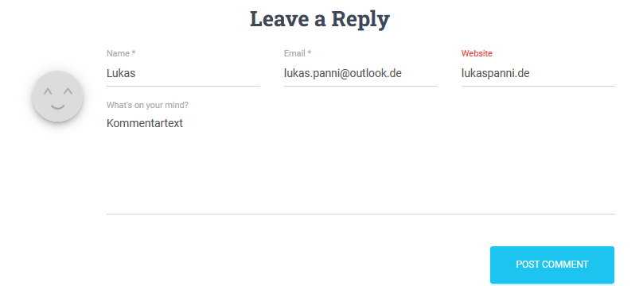
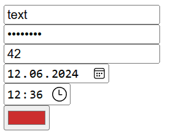
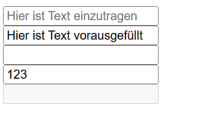
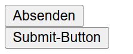
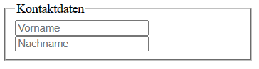

---
title: "Vorlesung Webengineering 1 - HTML Formulare"
topic: "Webengineering_1_4"
author: "Lukas Panni"
theme: "Berlin"
colortheme: "dove"
fonttheme: "structurebold"
fontsize: 12pt
urlcolor: olive
linkstyle: boldslanted
aspectratio: 169
lang: de-DE
section-titles: true
toc: true
numbersections: true
plantuml-format: svg
...

# HTML - Formulare

## HTML - Formulare Beispiele

{height=80%}

## HTML - Formulare Beispiele


Wie kommen die Daten zum Server?

## Wiederholung HTTP Kommunikation

### Abruf HTML-Seite

```{.plantuml height=60%}
Browser->Server : → GET URL
Server->Browser : → HTML-Response
Browser->Browser : Anzeige Webseite
```

## Versenden eines Formulars (POST)

```{.plantuml height=80%}
...
Browser->Browser : Formular Ausfüllen
Browser->Server : POST URL; Body: Formulardaten
```

## Versenden eines Formulars (GET)

```{.plantuml height=80%}
...
Browser->Browser : Formular Ausfüllen
Browser->Server : GET ...?param=value&param2=value2
```

## Versenden eines Formulars

- Durch Submit-Action (meist Button) wird neuer HTTP-Requeset ausgelöst
  - HTTP-Request enthält Formulardaten
  - Formular wird an URL gesendet, die im `action`-Attribut des `form`-Elements angegeben ist
- Meist wird `POST` verwendet
  - Übertragung der Daten im **Body**
  - Bei `GET`: Übertragung der Daten in den Query-Parametern der **URL**
  - Verwendung von `GET` verletzt die HTTP-Semantik (Abruf von Daten)!

## HTML Syntax - Formulare

- `<form>`
  - Umschließt einzelne Eingabefelder
  - `action`-Attribut: Ziel-URL
  - `method`-Attribut: HTTP-Methode: `GET`/`POST`
  - `enctype`-Attribut: Kodierung: `application/x-www-form-urlencoded` (Standard), `multipart/form-data` (z.B. für Datei-Upload)

## HTML Syntax - Eingabefelder

- `<input>`-Element
  - Eingabefeld, Art und Funktion von Attributen abhängig
  - `type`-Attribut: Art des Eingabefelds
  - `name`-Attribut: Name des Eingabefelds, ohne wird das Feld nicht übertragen!
  - `value`-Attribut: Vorausgefüllter Wert
  - `placeholder`-Attribut: Platzhalter, ähnlich wie `value`, aber nicht als Wert übertragen
  - `required`-Attribut: Pflichtfeld
  - `disabled`-Attribut: Deaktiviertes Feld
  - `autofocus`-Attribut: Fokus beim Laden der Seite
  - `autocomplete`-Attribut: Autocomplete aktivieren/deaktivieren

## HTML Syntax - Eingabefelder

```html
<form method="get" action="https://google.de">
  <input name="q" />
</form>
```

Absenden über `Enter` notwendig

{height=20%}
{height=20%}

## Eingabefelder - Typen

```html
<form method="post" action="">
  <input type="text" />
  <input type="password" />
  <input type="number" />
  <input type="date" />
  <input type="time" />
  <input type="color" />
</form>
```

Noch weitere, siehe [MDN/input#input_types](https://developer.mozilla.org/en-US/docs/Web/HTML/Element/input#input_types)

## Eingabefelder - Typen




## Eingabefelder - wichtige Attribute

```html
<form method="post" action="">
  <input placeholder="Hier ist Text einzutragen" />
  <input value="Hier ist Text vorausgefüllt" />
  <input required />
  <!-- Ohne dieses Feld kann das Formular nicht abgeschickt werden -->
  <input maxlength="3" />
  <input disabled />
</form>
```

## Eingabefelder - wichtige Attribute

{height=50%}

## Eingabefelder - Auswahlliste

```html
<form method="post" action="">
  <select name="test">
    <option value="1">Option 1</option>
    <option value="2">Option 2</option>
    <option value="3">Option 3</option>
  </select>
</form>
```

## Einagabefelder - Auswahlliste


`value`-Attribut der gewählten Option wird als Wert für das Feld mit dem `name`-Attribut des `select`-Elements übertragen


## Eingafelder - Datei-Upload

```html
<form method="post" action="" enctype="multipart/form-data">
  <input type="file" name="file" />
</form>
```


## Eingabefelder - Datei-Upload

- `enctype`-Attribut des `form`-Elements muss auf `multipart/form-data` gesetzt werden!
  - Ansonsten wird nur der Dateiname übertragen
- `accept`-Attribut des `input`-Elements kann verwendet werden, um bestimmte Dateitypen zu erlauben
  - `accept="image/*"`: Alle Bildtypen
  - `accept="image/png"`: Nur PNG-Bilder
  - `accept=".png,.jpg"`: Nur PNG- oder JPG-Bilder
  - `accept="*"`: Alle Dateitypen, oder Attribut weglassen
- `multiple`-Attribut des `input`-Elements erlaubt das Hochladen mehrerer Dateien

## Formulare - Buttons

- `<button>`-Element
  - `type`-Attribut: `submit`, `reset`, `button`
  - Inhalt des Elements als Beschriftung
- `<input>`-Element
  - `type`-Attribut: `submit`, `reset`
  - `value`-Attribut als Beschriftung
  - Automatische Lokalisierung der Beschriftung

- `submit`: Formular absenden
- `reset`: Formular zurücksetzen, alle Felder auf Standardwerte
- `button`: Keine vordefinierte Funktion, über JavaScript nutzbar


## Formulare - Submit

```html
<form method="post" action="">
  <input type="submit" /><br>
  <button type="submit">Submit-Button</button>
</form>
```

{height=20%}

Kein wirklicher Unterschied, Buttons sind meist vorzuziehen und können besser gestaltet werden.

Verwendung des Button-Attributs ist außerdem semantisch korrekter.

## Formulare - Labels

- `<label>`-Element
  - `for`-Attribut: Verweis auf `id`-Attribut eines anderen Elements
  - Inhalt des Elements als Beschriftung

```html
<form method="post" action="">
  <label for="test">Test</label>
  <input id="test" />
</form>
```

{height=10%}

## Formulare - Gruppierung

- `<fieldset>`
  - Umschließt mehrere Eingabefelder
- `<legend>`
  - Beschriftung für `<fieldset>`

```html
<form method="post" action="" >
  <fieldset>
    <legend>Kontaktdaten</legend>
    <input placeholder="Vorname"/>
    <input placeholder="Nachname"/>
  </fieldset>
</form>
```

## Formulare - Gruppierung




## Praxisübung HTML-Formulare

- Erstellt ein HTML-Formular das die Eingabe folgender Daten ermöglicht und beschriftet die Eingabefelder entsprechend:
  - Name (Vorname + Nachname)
  - E-Mail-Adresse 
  - Geburtsdatum
  - Geschlecht
  - Lieblingsfarbe 
  - Profilbild
  - Passwort
  - Passwort wiederholen 
- Wählt geeignete Eingabetypen und setzt andere Attribute wo sinnvoll

**Hinweis**: `https://httpbin.org/post` kann als Ziel-URL verwendet werden, um die gesendeten Daten zu überprüfen.
