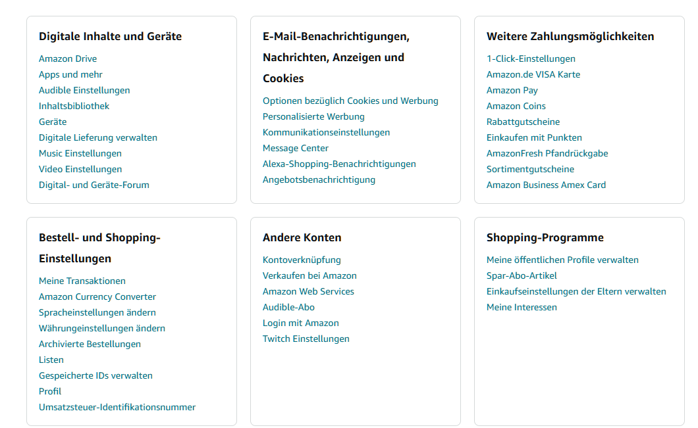
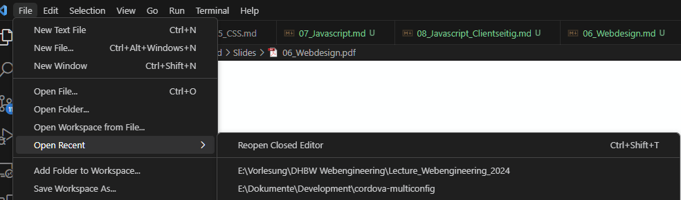
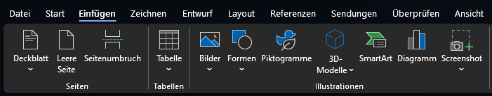
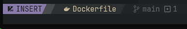
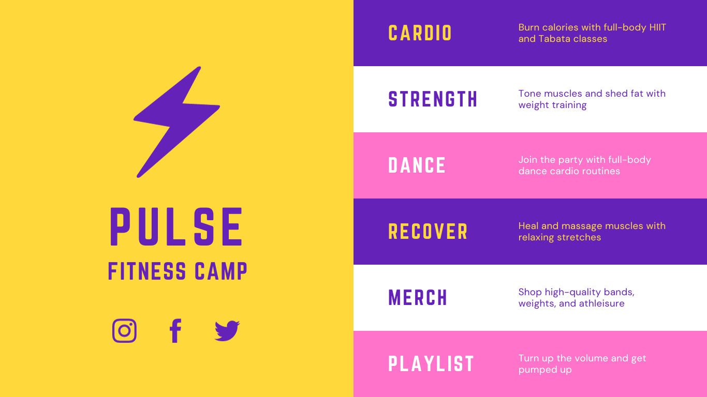
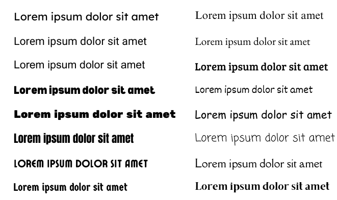
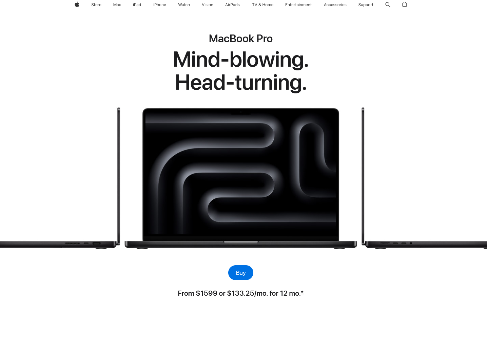

---
title: "Vorlesung Webengineering 1 - Webdesign"
topic: "Webengineering_1_6"
author: "Lukas Panni"
theme: "Berlin"
colortheme: "dove"
fonttheme: "structurebold"
fontsize: 12pt
urlcolor: olive
linkstyle: boldslanted
aspectratio: 169
lang: de-DE
section-titles: true
toc: true
numbersections: true
plantuml-format: svg
...

# Grundlagen

## Wichtige Aspekte im Webdesign

- Benutzer- und menschenzentrierte Entwicklung
- Interkulturelle Aspekte
- Barrierefreie Gestaltung
- Wirtschaftlichkeit

\rightarrow{} Immer Kompromisse!

## Internationalisierung

i18n = _internationalization_ (i + 18 Buchstaben + n)

> [W3C](https://www.w3.org/International/questions/qa-i18n.de.html)
>
>
> "Design und der Entwicklung eines Produkts, einer Anwendung oder eines Dokuments, das leichte Lokalisierung für Zielgruppen, die in Kultur, Region oder Sprache variieren, ermöglicht"

## Internationalisierung

- Einheitlich nutzbare Zeichenkodierung (Unicode, UTF-8)
- Nicht Lateinische Schriftzeichen und bidirektionalen Text beachten
- Lokal, regional und kulturelle Präferenzen ermöglichen
- Trennen von Quellcode und Inhalt

## Lokalisierung

l10n = _localization_

> [W3C](https://www.w3.org/International/questions/qa-i18n.de.html)
> 
>
> "Angleichung eines Produkts, einer Anwendung oder eines Dokuments, um der Sprache, den kulturellen oder anderen Anforderungen eines bestimmten Zielmarktes (ein lokaler "Schauplatz") zu entsprechen."

## Lokalisierung

Anpassung von:

- Zahlen, Datums- und Zeitformate
- Währungen
- Symbole, Zeichen und Farben
- Metaphern und Bilder
- ...

Und natürlich Übersetzung!

## User Experience (UX)

> **ISO 9241-210**
>
> 
> "Wahrnehmungen und Reaktionen einer Person, die aus der tatsächlichen und/oder der erwarteten Benutzung eines Produkts, eines Systems oder einer Dienstleistung resultieren."

\rightarrow{} Alle Aspekte bei der Interaktion eines Nutzers mit einem Produkt

## Usability

> **ISO 9241-210**
> 
> 
> "Ausmaß, in dem ein System, ein Produkt oder eine Dienstleistung durch bestimmte Benut- zer in einem bestimmten Nutzungskontext genutzt werden kann, um festgelegte Ziele **effektiv**, **effizient** und **zufriedenstellend** zu erreichen."

## Usability

- Effektivität: Anwender **kann** Aufgabe erledigen
- Effizienz: Aufgaben werden mit **minimalem Aufwand** erledigt
- Zufriedenheit: Arbeiten mit Software wird nicht als **langweilig**, **Stress auslösend** oder **störend** empfunden

+ Angenehme Erfahrung: Nutzung der Software wird als **angenehm** empfunden \rightarrow{} **positive User Experience**

# Wahrnehmung

## Kognitive Grundlagen

- Arbeitsgedächtnis (Kurzzeitgedächtnis)
  - Geringe Kapazität (7 +/- 2 Chunks)
  - Kurze Verweildauer (wenige Sekunden)

\rightarrow{} Geschickte Gruppierung zur Unterstützung von Chunking, Ablenkungen vermeiden, Fokus auf das Wesentliche

## Präattentive und Attentive Wahrnehmung

Präattentive Wahrnehmung:

- Wahrnehmung von Eigenschaften eines Objekts ohne bewusste Aufmerksamkeit
  - \rightarrow{} Schnell und automatisch

Attentive Wahrnehmung:

- Bewusste Wahrnehmung von Objekten
  - \rightarrow{} Langsamer

## Präattentive Wahrnehmung Beispiel

{height=90%}

## Gestaltgesetze

- Wahrnehmung wird durch Gestaltgesetze beeinflusst
  - z.B. was wird als zusammengehörig wahrgenommen?
- Gestaltgesetze sind nicht universell gültig: Kulturabhängig, kontextabhängig, ...
- Können bewusst eingesetzt werden, um Wahrnehmung zu beeinflussen
  - Kann Webseite einfacher verständlich machen
  - Kann zu angenehmerer Erfahrung beitragen

## Gesetz der Nähe

Objekte, die nah beieinander liegen, werden als zusammengehörig wahrgenommen (auch das Gegenteil ist der Fall)

{height=70%}

## Gesetz der Gleichheit

Gleichheit von Form oder Farbe führt zu Wahrnehmung als zusammengehörig

{height=70%}

## Gestaltgesetze: weitere Beispiele

- [achtung-designer.com](https://achtung-designer.com/gestaltgesetze-die-designs-besser-machen/)
- [cmyktastic.ch](https://www.cmyktastic.ch/gestalterische-gesetze/)

## Wahrnehmung von Bewegung

- Bewegung wird im gesamten Sichtfeld gut wahrgenommen
- Kann Aufmerksamkeit auf sich ziehen
  - \rightarrow{} Kann auch ablenken 
- Gleichzeitige Bewegungen können nur begrenzt wahrgenommen werden

Einsatz:

- Aufmerksamkeit lenken
- Veränderungen verständlich machen
  - Verkleinern, vergrößern von Fenstern
  - Auf- und Zuklappen von Elementen

# Gestaltung

## Gestaltung von Bedienelementen

Affordances:

- Eigenschaften eines Objekts, die eine bestimmte Nutzung nahelegen
  - z.B. Türklinke, Lichtschalter, Button auf Webseite
- Design muss Affordances deutlich machen
  - z.B. Button muss wie ein Button aussehen, Cursor ändert sich beim Hover, ...

- Probleme durch
  - Versteckte Affordances: Werden nicht erkannt
  - Falsche Affordances: Legen eine falsche Nutzung nahe

## Gestaltung von Bedienelementen

Constraints:

- Freiheitsgrade sinnvoll einschränken
- Unterbinden falscher Bedienung
  - Button deaktivieren, wenn Bedingungen nicht erfüllt sind
  - Cursor verschwindet, wenn nicht geklickt werden darf
  - Form von Steckverbindungen

## Feedback

- Rückmeldung über Aktionen
  - Hilft bei Entwicklung des mentalen Modells des Systems
- Reaktion sollte schnell erfolgen und klar wahrnehmbar sein
- Mit Maß: Nutzer nicht überfordern
- Beispiele
  - Drücken von Button wird durch Farbwechsel und Animation bestätigt
  - Rot umrandete Felder zeigen Fehlerhafte Eingaben an
  - Fortschrittsanzeige (bei Aktionen länger als ~5s)

## Entwurfsprinzip: Strukturierung der Benutzerschnittstelle

{height=75%}

## Entwurfsprinzip: Kombination visueller und textueller Elemente

- Hilft bei Verständnis, Redundanz ist hier meist nicht negativ!

{height=75%}

## Entwurfsprinzip: Sichtbarkeit von Systemzuständen und möglichen Aktionen

- Verschiedene Modi müssen unterscheidbar sein

{height=20%}
{height=20%}

## Entwurfsprinzip: Konsistenz

- **Sprachlich**: gleiche Begriffe für gleiche Dinge
- **Grafisch**: Farben, Fonts, Effekte, ...
- **Interaktionskonsistenz**: gleiches/ähnliches Verhalten

- Konsistenz zwischen Programmen
  - Tastenkürzel, Menüstruktur
  - Beispiel: Microsoft Office, Standard-Tastenkürzel für Kopieren, Einfügen, ...

## Styleguides

- Best Practices, konkrete Vorgaben
- Sorgen für Konsistenz
- Beispiele
  - [Apple Human Interface Guidelines](https://developer.apple.com/design/human-interface-guidelines/)
  - [Style for Windows Apps](https://learn.microsoft.com/en-us/windows/apps/design/style/)
  - [Google Material Design](https://m3.material.io/)

## Farbgestaltung

- Auswirkungen auf Emotionen
- Können Aufmerksamkeit lenken
- Können Informationen vermitteln (z.B. Ampel)

Empfehlungen:

  - Beschränken auf wenige Farben
  - Konsistenz!
  - Kontrast von Text und Hintergrund beachten

## Farbgestaltung Beispiel

{height=75%}

## Typografie

- Typografie wird häufig unterschätzt
- Kann Charakter der Webseite bestimmen
- Schriftart, Schriftgröße, ... haben großen Einfluss auf Lesbarkeit
  - Lesbarkeit ist wichtig, um Nutzer kognitiv nicht zu überlasten
  - \rightarrow{} Informationen können schnell und korrekt aufgenommen werden

Empfehlungen:

  - Beschränken auf wenige verschiedene Schriftarten
  - Serifenlose Schrift als Hauptschrift bevorzugen (Serifen können oft verpixelt wirken)
  - Wirkung von Schriftarten beachten

  
## Typografie Beispiel

{height=75%}

## Responsive Design

- Anpassung an verschiedene Bildschirmgrößen
- Heute sind mobile Geräte vorherrschend \rightarrow{} Mobile First
  - ABER immer vom Kontext abhängig!
- Touchscreens erlauben andere Interaktionen als Maus und Tastatur

Empfehlungen:

  - Verschiedene Geräte früh berücksichtigen
  - Unterschiede bei Touch vs. Maus/Tastatur beachten
    - Elemente brauchen mehr Platz
    - Andere Interaktionen möglich

## Responsive Design Beispiel

{width=70%}

## Keine Angst vor Weißraum

- Weißraum/Negativraum: "leerer" Bereich zwischen Elementen
- Ist kein "verschwendeter" Platz!
  - Erhöht Lesbarkeit
  - Hilft bei Strukturierung
  - Hilft bei User-Führung
  - Trägt zu Ästhetik bei

## Beispiel Apple Webseite

\centering

## Abschließende Empfehlungen

- Konsistenz ist sehr wichtig
- Weniger ist oft mehr, keine Angst vor Weißraum
- Probiert verschiedene Designs aus
  - Ein gutes Design entwickelt sich iterativ
  - Nutzerfeedback ist wichtig

- Es gibt nie das perfekte Design!

## Ressourcen

- [5 Academic Research Papers Every Designer Should Read](https://uxdesign.cc/5-academic-research-papers-every-designer-should-read-f24b170db295)
- [Design Principles](https://principles.design/)
- [Apple Human Interface Guidelines](https://developer.apple.com/design/human-interface-guidelines/)
- [Style for Windows Apps](https://learn.microsoft.com/en-us/windows/apps/design/style/)
- [Google Material Design](https://m3.material.io/)