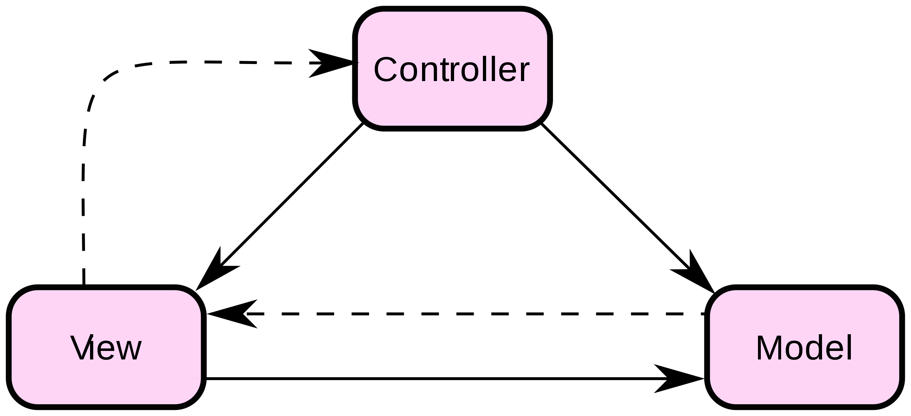

---
title: "Vorlesung Webengineering 1 - Webarchitekturen"
topic: "Webengineering_1_9"
author: "Lukas Panni"
theme: "Berlin"
colortheme: "dove"
fonttheme: "structurebold"
fontsize: 12pt
urlcolor: olive
linkstyle: boldslanted
aspectratio: 169
lang: de-DE
section-titles: true
toc: true
numbersections: true
plantuml-format: svg
...

# Grundlagen

## Client vs. Server

- Server: Software, die Dienste bereitstellt
  - z.B. Web**server**, Datenbank**server**
  - Aber auch: Hardware, auf der die Server-Software läuft!
- Client: Software, die Dienste nutzt
    - z.B. Web**browser**, Datenbank**client**
- Kontextabhängig
    - Server kann auch selbst Client sein: Webserver ist Client für Datenbankserver
    - Client kann auch selbst Server sein

## Client-Server Architektur

Aufteilung von Software in Server und Client, die über ein Netzwerk interagieren.
**Webanwendungen**: Webserver + Webbrowser

Fragen:

- Wie werden Aufgaben aufgeteilt?
- Wie wird die Kommunikation zwischen Client und Server organisiert?
- Umsetzung von: Sicherheit, Skalierbarkeit, Performance, ...

## Exkurs: Softwarearchitektur

**Softwarearchitektur**: Strukturierung eines Softwaresystems in Komponenten und deren Beziehungen

Zentrale Punkte:

- Modularisierung und **Struktur**: Aufteilung in Komponenten
- Modularisierung und **Kommunikation**: Schnittstellen zwischen Komponenten
- Modularisierung und **Deployment**: Verteilung von Komponenten auf Hardware

## Exkurs: Softwarearchitektur - Strukturierung

- Zerlegung von komplexen Aufgaben in kleinere Teilprobleme
  - Komponenten lösen das Gesamtproblem durch Zusammenarbeit
- Abhängigkeiten zwischen Komponenten
  - Änderung an A bedingt Änderung an B
  - Änderungen an A und B müssen koordiniert werden! Schlecht für neue Features und Anpassungen
  - \rightarrow{} Abhängigkeiten minimieren und klar abwägen

## Exkurs: Softwarearchitektur - Kommunikation

- Gesamtproblem erfordert Zusammenarbeit, Zusammenarbeit erfordert Kommunikation
- Kommunikation über Schnittstellen
  - Welche Informationen werden wie ausgetauscht: Datenstrukturen, Codierung, ...
  - _Vertrag_ zwischen Komponenten
  - Sollten stabil sein! \rightarrow{} Änderungen erfordern Koordination
- Kommunikationsarten: Synchron / Asynchron
- Kommunikationsmuster
  - Request / Reply - 1:1
  - Publish / Subscribe - 1:n
\rightarrow{} Viele Entscheidungen, nicht trivial!

## Exkurs: Softwarearchitektur - Deployment

**Deployment** = Bereitstellung von Software

- Verwaltung der Hardware heute meist durch Cloud-/Hosting-Anbieter
- Deploymentstrategie hat Einfluss auf: 
  - Skalierbarkeit
  - Performance
  - Kosten
  - ...
- Hauptstrategien:
  - Monolithisch: gesamte Anwendung auf einem Server
  - (Micro)-Services: Eigenständige Komponenten auf verschiedenen Servern
  - \rightarrow{} Abstufungen und Mischformen möglich und sinnvoll

# Webarchitekturen

## Klassische Architektur: Schichten

- Anwendung wird in Schichten aufgeteilt
- Typische 3 Schicht-Architektur:
  - Präsentation: Browser
  - Anwendung: Webserver
  - Daten: Datenbank
- Jede Schicht kennt nur die direkt darunterliegende Schicht
  - Darüberliegende Schicht ist durch klare Schnittstellen prinzipiell egal

## Aufgabenverteilung Schichtenarchitektur

Klassische Aufgabenverteilung:

- Browser: Darstellung und Interaktion mit Benutzer
  - HTML, CSS
  - JavaScript vor allem zu Darstellungszwecken: Formularvalidierung, Animationen, ...
- Webserver: Komplette Anwendungslogik
  - Generierung von HTML-Seiten
  - Verarbeitung von Eingaben
  - Abruf von Daten
- Datenbank: Speicherung von Daten

## Klassische Aufteilung der Anwendungslogik

{height=75%}

## Pattern: MVC 

- Definition
  - **MVC:** Model-View-Controller
  - **Ziel:** Flexible, wartbare und wiederverwendbare Software durch Trennung von Daten, Darstellung und Logik

## MVC UML-Diagramm

{height=75%}

## MVC Komponenten und Verantwortlichkeiten

- **Model**
  - Umfasst Anwendungsdaten (und eventuell Logik zur Änderung dieser)
  - Unabhängig von View und Controller
  - Benachrichtigung der View über Änderungen über Observer-Pattern

- **View**
  - Anzeige der Daten
  - Minimale Logik, Fokus auf Präsentation

- **Controller**
  - Behandelt Benutzeranfragen und steuert den Ablauf
  - Interaktion mit Model
  - Auswahl der View
  

## MVC in Webanwendungen (1)

- Einfache Zuordnung von MVC-Komponenten zu Schichten
  - Model: Datenbank
  - View: HTML-Seite im Browser
  - Controller: Webserver 

- Ablauf:
  - Browser sendet Anfrage an Webserver (Controller)
  - Controller verarbeitet Anfrage mithilfe des Models und erzeugt HTML-Seite (View)

## MVC in Webanwendungen (2)

{height=72%}

## Verteilung der Anwendungslogik

Klassischer Ansatz: Anwendungslogik komplett auf Webserver

- **Probleme**: 
  - Performance: Jede Aktion erfordert Verarbeitung auf Webserver \rightarrow{} Seite muss neu berechnet werden
  - Skalierbarkeit: Server braucht verhältnismäßig viel Rechenleistung
  - Benutzerfreundlichkeit: Jede Aktion erfordert Neuladen der Seite \rightarrow{} Ladezeiten, verzögertes Feedback etc.
- **Lösung**: Anwendungslogik auf Client verlagern
  - Unterschiedliche Granularität möglich
  - MVC Komponenten lassen sich nicht mehr so einfach zuordnen

## Verlagerung der Anwendungslogik (1)

{height=75%}

## Verlagerung der Anwendungslogik (2)

{height=75%}

## MVC bei Clientseitiger Anwendungslogik 

{height=75%}

## Anwendungslogik auf Client

Auch nicht frei von Problemen:

- **Sicherheit**: dem Client kann nicht vertraut werden!
  - Manipulation von Daten
  - Manipulation von Anwendungslogik
  - \rightarrow{} Server muss alle Eingaben validieren und verarbeiten
- **Performance**: Gesamte Anwendungslogik muss auf Client geladen werden
  - \rightarrow{} Lange Ladezeiten
  - \rightarrow{} Hoher Speicherbedarf

\rightarrow{} Kompromiss notwendig!

\rightarrow{} In der Praxis nie klar abgrenzbar wo die Anwendungslogik liegt!

## RESTful APIs

- **API:** Application Programming Interface
  - Schnittstelle, die den Zugriff auf eine Softwarekomponente ermöglicht
- **RESTful**: dem REST-Stil folgend, siehe 02_HTTP_REST
  - Ressourcenorientiert
  - Zustandslos
  - Einheitliche Schnittstelle für Arbeit mit Ressourcen

## RESTful APIs - Ressourcen

- Ressourcen sind die zentralen Elemente einer RESTful API
  - Abstraktion von Daten, Zuständen, Prozessen, ... und den zugehörigen Operationen
  - Zugriff über URIs
- CRUD-Operationen (Create, Read, Update, Delete) auf Ressourcen
  - \rightarrow{} Verwendung der HTTP-Methoden POST, GET, PUT, DELETE
  - \rightarrow{} Einheitlich für alle Ressourcen
- **Schwierig**: Welche Ressourcen gibt es? Wie feingranular sind diese? 

## RESTful APIs - Best Practices

- HTTP-Features nutzen
  - Methoden und ihre Semantik
  - Statuscodes
  - Content-Negotiation
- Konsistenz: Namensgebung, Struktur, ...
- Tipps für URI-Gestaltung:
  - Gruppierung von Ressourcen in Collections
  - Hierarchische Strukturierung
  - Keine Verben \rightarrow{} HTTP-Methoden für Auswahl der Funktion nutzen!
  - Keine Dateiendungen

# Aktuelle Entwicklungen

## Single Page Applications

- Eine einzige HTML-Seite ("Single Page")
  - Dynamisches Nachladen von Inhalten, DOM wird auf Client erzeugt
- Anwendungslogik größtenteils auf Client
  - Validierung und Speicherung von Daten auf Server \rightarrow{} auch ein Teil der Anwendungslogik

**Ziele / Einsatzszenarien**

- Bessere Benutzererfahrung: Hohe Interaktivität
  - schnelleres Feedback
  - Reduktion von Ladezeiten
- Skalierbarkeit durch Verlagerung der Anwendungslogik auf Client
- Offlinefähigkeit einfacher umsetzbar

## Progressive Web Apps (PWAs)

- "Weiterentwicklung" von Single Page Applications
- Webanwendungen, die wie native Apps wirken
  - Insbesondere **Offlinefähigkeit**
  - Auf Smartphones "installierbar"
  - Push-Benachrichtigungen
  - Zugriff auf Gerätefunktionen (Kamera, GPS, ...)
- Kostenvorteile gegenüber nativen Apps
- Einfach Aktualisierbar

## Architektur PWA

{height=75%}

## PWA - Service Worker

- Grundlage für Offlinefähigkeit
- JavaScript-Programm in separatem Thread
  - Kein DOM-Zugriff
  - Eventbasierte Kommunikation mit Hauptthread (Webanwendung)
- Proxy zwischen Browser und Server
  - Anfragen gehen über Service Worker, nicht direkt an Server
  - Service Worker kann selbst antworten oder an Server weiterleiten
  - Zwischenspeichern von Daten möglich

## PWA Umsetzung

- Manuelle Umsetzung ist möglich aber aufwändig und komplex
- Frameworks und Bibliotheken mit entsprechender Unterstützung
  - Angular, React, Vue, ...
- Offlinefähigkeit sollte von Anfang an berücksichtigt werden!

## Nachteile PWAs

- Keine Vollständige Browserunterstützung
  - Beste Unterstützung in Chromium-basierten Browsern
  - Mittelmäßig in Safari (und dadurch alle iOS-Geräte!) und Firefox
- Eingeschränkter Zugriff auf Gerätefunktionen
- Geringere Performance als native Apps

\rightarrow{} In vielen Fällen gut geeignet

- **Alternative**: Frameworks für hybride Apps (Mix aus nativer App und Webanwendung)
  - Capacitor, Cordova, React Native, ...

## Content Delivery Networks (CDNs)

- Weltweite Auslieferung von Medien (Bilder, Videos, ...) ist komplex
  - Nutzer erwarten schnelle Ladezeiten und hohe Verfügbarkeit
  - Wechselnde Nutzerzahlen
  - Nutzer sind weltweit verteilt \rightarrow{} verschieden lange Übertragungswege

\rightarrow{} Mit **CDNs** muss keiner diese Probleme selbst lösen!

- Weltweit verteilte Server, die Inhalte cachen
- Anfragen an nächstgelegenen CDN-Server
  - Antwort aus dem Cache oder Weiterleitung an den Ursprungsserver und Caching der Antwort
  - Je größer die Nutzerzahl, desto wahrscheinlicher ist gewünschter Inhalt im Cache!

## 

{height=85%}

## CDN - Vorteile

- Kürzere Übertragungswege
  - Schnellere Ladezeiten
  - Geringerer Bandbreitenverbrauch am Ursprung \rightarrow{} Kosten
- Hohe Verfügbarkeit und Skalierbarkeit durch Redundanz
- Geringere Last auf Ursprungsserver
- Security-Features: DDoS-Schutz, TLS, ...

## CDN - Nachteile

- Ungeeignet für dynamische Inhalte
  - Cache bringt nur Vorteile, wenn häufig gleiche Inhalte ausgeliefert werden
- Aufwand für Konfiguration und Wartung
  - Aber: keine eigene geographische Verteilung notwendig

## CDN Anbieter

- Cloudflare
- Akamai
- Jetpack (für WordPress-Websites)
- Cloud-Provider (AWS CloudFront, Azure CDN, Google Cloud/Media CDN, ...)