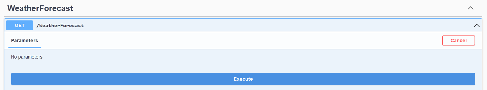
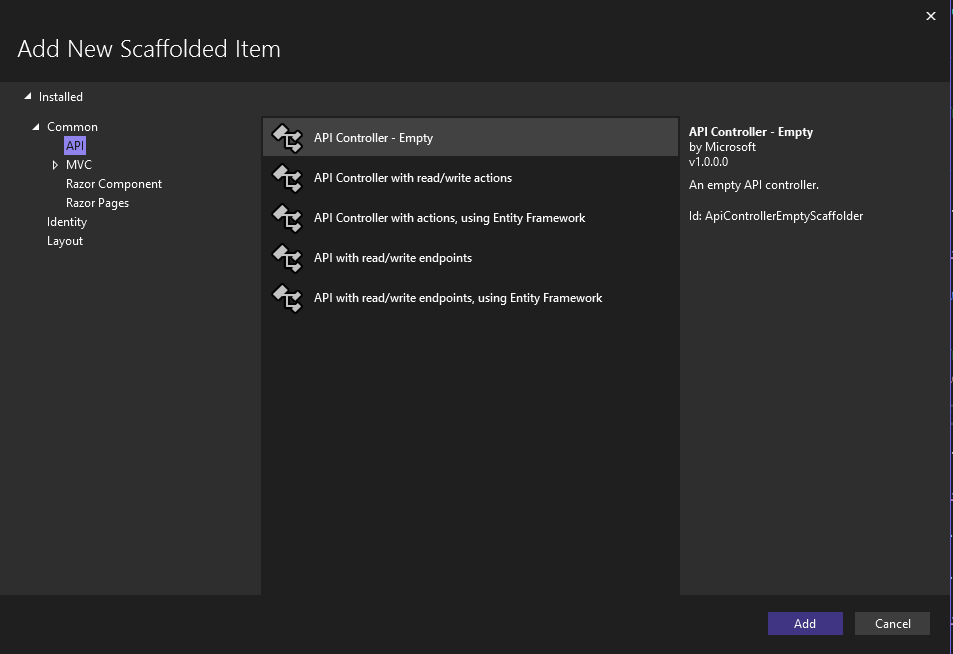

---
title: "Vorlesung Webengineering 1 - ASP.NET Core"
topic: "Webengineering_1_12"
author: "Lukas Panni"
theme: "Berlin"
colortheme: "dove"
fonttheme: "structurebold"
fontsize: 12pt
urlcolor: olive
linkstyle: boldslanted
aspectratio: 169
lang: de-DE
section-titles: true
plantuml-format: svg
...

# Einführung ASP.NET Core

## Grundlagen

- Webframework für .NET > 5.0
  - Webentwicklung mit C# \rightarrow{} Vor- und Nachteile gegenüber JavaScript
- Verwendbar für komplette Webanwendungen oder APIs
  - Fokus hier auf REST-APIs

## Installation

- Voraussetzungen: .NET SDK (aktuelle Version 8.0)
  - Windows: `winget install Microsoft.DotNet.SDK.8`
  - macOS (homebrew): `brew install --cask dotnet`
- Visual Studio Code oder Visual Studio
  - VS Code: [C#-Erweiterung](https://marketplace.visualstudio.com/items?itemName=ms-dotnettools.csharp)
  - VS: ASP.NET und Webentwicklung Workload (im Installer auswählen)

## API-Entwicklung mit ASP.NET Core

2 Ansätze:

### Controller-basierte APIs

- Klare, vorgegebene Struktur mit guter automatischer Codegenerierung
- Gut geeignet für komplexe Projekte

### Minimal APIs

- Weniger Struktur, höhere Flexibilität \rightarrow{} Struktur ähnlich zu Express
- Keine automatische Codegenerierung
- Gut geeignet für kleine/einfache Projekte

# Controller-basierte APIs

## Projekt erstellen (Controller-basiert)

- `dotnet new webapi --use-controllers -o <NAME>`
  - Oder über die Oberfläche von Visual Studio
- Standard-Vorlage:
  - `WeatherForecastController` + `WeatherForecast` Model
  - `GET`-Methode mit zufälligen Daten
  - Automatische Generation von Swagger/OpenAPI-Dokumentation

## Vorlage ausführen

- `dotnet run` im Projektordner
  - Alternativ: Visual Studio Code/Visual Studio UI nutzen
- Beispiel unter `http://localhost:<PORT>/weatherforecast`
  - Port aus `Properties/launchSettings.json` oder der Ausgabe von `dotnet run`
- Zusätzliche OpenAPI/Swagger-Dokumentation unter `http://localhost:<PORT>/swagger`
  - Gut zum Testen!

## Swagger UI



## Grundstruktur

- `Program.cs`: Startpunkt der Anwendung
  - Allgemeine Konfiguration: Controller, Datenbank, Authentifizierung / Autorisierung, ...
- `Controllers/`: Controller-Klassen
  - Implementierung der CRUD-Operationen
  - Konfiguration von Routen, Parametern, Rückgabewerten, ...
- `Models/` (üblicherweise): Model-Klasse = Datenstrukturen der API
  - Häufig zusätzlich: DTOs (Data Transfer Objects) für Input/Output

## Beispiel-Controller (1)

```C#
[ApiController]
[Route("[controller]")]
public class WeatherForecastController : ControllerBase{
    ...
    [HttpGet(Name = "GetWeatherForecast")]
    public IEnumerable<WeatherForecast> Get(){...}
```

## Beispiel-Controller (2)

- `[ApiController]` definiert Klasse als API-Controller \rightarrow{} automatische Model-Validation, Content-Type-Verarbeitung, ...
- `[Route]` definiert Basis-URL für alle Methoden
  - Hier: `/weatherforecast` (Controller-Name ohne "Controller")
- `[HttpGet]` definiert Methode als Handler für HTTP-GET-Route
  - Konvertierung in Ausgabeformat (i.d.R. JSON) erfolgt automatisch

## Beispiel-Model

```C#
public class WeatherForecast
{
    public DateOnly Date { get; set; }
    public int TemperatureC { get; set; }
    public int TemperatureF => 32 + (int)(TemperatureC / 0.5556);
    public string? Summary { get; set; }
}
```

\rightarrow{} Triviale Datenklasse

## API erweitern: eigene Model-Klasse

- Sehr einfaches Beispiel: `User`:

```C#
public record class User(long Id, string Username, string Email);
```

- Nutzt C# `record` für einfache Datenklassen \rightarrow{} für viele Use-Cases vollkommen ausreichend
  - Automatische Properties (getter/setter)
  - Automatische `Equals` Implementierung

## API erweitern: Datenbankverbindung

- Datenbankverbindung über Entity Framework Core
  - `dotnet add package Microsoft.EntityFrameworkCore.<DBType>`
    - z.B. `InMemory` für lokale Tests, `SqlServer` für Produktivumgebung
  - Alternative Datenbank Provider für andere Datenbanken
- Erstellen von Datenbank-Kontext (hier sehr einfach)

```C#
public class UserContext(DbContextOptions<UserContext> options) : DbContext(options)
{
  public DbSet<User> Users { get; set; }
}
```

## API erweitern: Dependency Injection

- Konfiguration von Dependency Injection in `Program.cs`
  - Datenbankkontext wird in der Anwendung registriert
  - Automatische Verwaltung des Objekts
  - Automatisches Übergeben an Controller-Klassen

Einfügen vor `builder.Build()`:

```C#
builder.Services.AddDbContext<UserContext>(options =>
    options.UseInMemoryDatabase("Users"));
```

## API erweitern: Controller Klasse (1)

- Einfache Controller meist komplett automatisch generierbar
- Visual Studio: UI zur Generierung (Rechtsklick auf Ordner > "Add" > "Controller")

## API erweitern: Controller Klasse (2)

{height=65%}

## API erweitern: Controller Klasse (3)

Ohne Visual Studio: CLI-Tool `dotnet aspnet-codegenerator` nutzen

Installation (mit Abhängigkeiten):

```bash
dotnet add package Microsoft.VisualStudio.Web.CodeGeneration.Design
dotnet add package Microsoft.EntityFrameworkCore.Design
dotnet add package Microsoft.EntityFrameworkCore.SqlServer
dotnet add package Microsoft.EntityFrameworkCore.Tools
dotnet tool install -g dotnet-aspnet-codegenerator
```

## API erweitern: Controller Klasse (4)

Code-Generierung:

```bash
dotnet aspnet-codegenerator controller -name <ControllerName> -async
 -api -m <ModelClass> -dc <ContextClass> -outDir Controllers
```

- Nutzt die Informationen aus der Model-Klasse für CRUD Methoden
- Datenbankkontext wird automatisch eingebunden

## API erweitern: Controller Klasse (5)

Beispiel: `UserController` mit `User`-Model und `UserContext`-Datenbankkontext

```C#
[Route("api/[controller]")]
[ApiController]
public class UserController : ControllerBase
{
    private readonly UserContext _context;
    public UserController(UserContext context){
        _context = context;
    }
    ...
```

## API erweitern: Controller Klasse (6)

```C#
// GET: api/User
[HttpGet]
public async Task<ActionResult<IEnumerable<User>>> GetUsers(){
  return await _context.Users.ToListAsync();
}
...
```

## Weiterführende Ressourcen

- [ASP.NET Core Dokumentation](https://docs.microsoft.com/aspnet/core/?view=aspnetcore-8.0)
- [Tutorial: Controller-basierte-API](https://learn.microsoft.com/aspnet/core/tutorials/first-web-api?view=aspnetcore-8.0&tabs=visual-studio-code)
- [Tutorial: Minimal-API](https://learn.microsoft.com/aspnet/core/tutorials/min-web-api?view=aspnetcore-8.0&tabs=visual-studio-code)

## Praxisaufgabe

Erstellt eine einfache Controller-basierte API zur Verwaltung von Nachrichtenartikeln mit ASP.NET Core.
Jeder Artikel hat einen Autor (Name reicht), einen Titel, ein Veröffentlichungsdatum, einen Text (HTML) und eine Liste von Tags (Komma-separierte Liste reicht aus).
Die In-Memory Datenbank kann hier genutzt werden, aber Achtung: beim Neustart der Anwendung müssen die Artikel wieder hinzugefügt werden (POST-Request).

# Minimal APIs - Schnelldurchlauf

## Projekt erstellen und Grundstruktur

`dotnet new webapi -o <NAME>` (oder über Visual Studio UI)

- Erzeugt Konfigurationen und `Program.cs`

```C#
var builder = WebApplication.CreateBuilder(args);
var app = builder.Build();
app.MapGet("/", () => "Hello World!");
app.Run();
```

Ausführen mit `dotnet run` oder über die UI der IDE

## Minimal APIs - Routing

- Zuordnung von Handlern zu Routen ähnlich wie bei express
  - `app.MapGet("/route", <Handler-Function>);`
  - Analog für `MapPost`, `MapPut`, `MapDelete`, ...
- Handler-Funktionen meist als Lambda direkt in der Zuordnung
- Routenparameter und Rückgabewerte wie bei Controller-basierten APIs

## Minimal APIs - Datenbankverbindung

Analog zu Controller-basierten APIs

- NuGet-Paket für Datenbankverbindung hinzufügen & Verbindung konfigurieren
- Model-Klasse & Datenbankkontext erstellen
- Dependency Injection konfigurieren: `builder.Services.AddDbContext<...>(...);`
- Datenbankkontext in Handler-Funktionen nutzen: `MapGet("/", (Context context) => ...)`

## Minimal APIs - Beispiel

```C#

app.MapGet("/api/users/{id}", async (UserContext context, long id) =>
    await context.Users.FindAsync(id) is User user
        ? Results.Ok(user)
        : Results.NotFound());

app.MapPost("/api/users", async (UserContext context, User user) =>
{
    context.Users.Add(user);
    await context.SaveChangesAsync();
    return Results.Created($"/api/users/{user.Id}", user);
});
...
```
